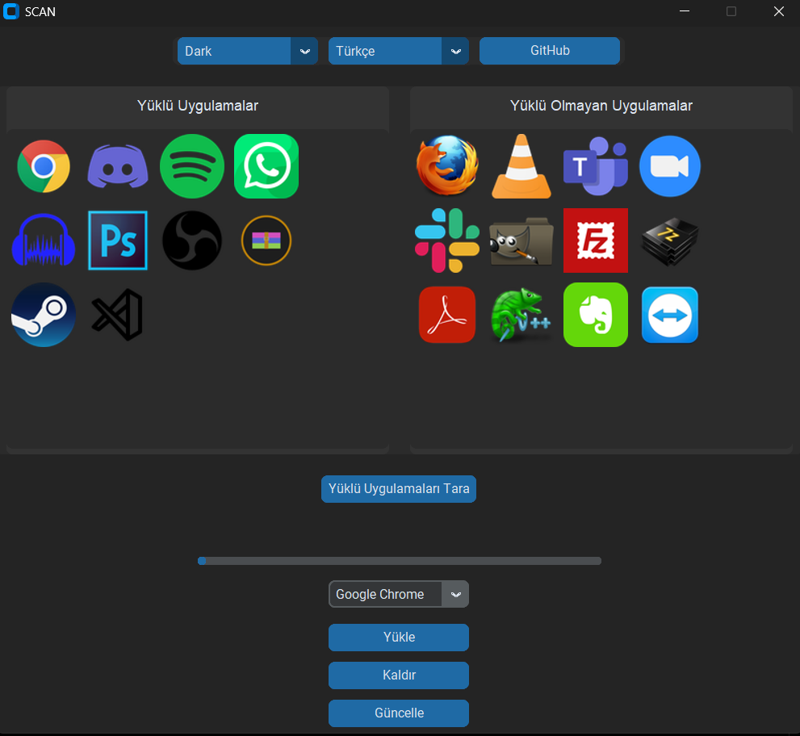

# SCAN – Winget GUI (CustomTkinter)

Windows için çok dilli, tema destekli, **winget** tabanlı uygulama tarayıcı ve yönetici.  
Yüklü/yüklü olmayan uygulamaları ikonlarla gösterir; seçtiğiniz uygulamayı **Yükle / Kaldır / Güncelle** komutlarıyla tek tıkla yönetir.



---

## ✨ Özellikler

- 🌓 **Koyu/Açık Tema** (CustomTkinter)
- 🌐 **Çok dilli arayüz**: Türkçe, English, Русский, Deutsch, 中文, Español, العربية  
- 🔍 **Yüklü / Yüklü olmayan** uygulamaları listeleme (winget)
- ⬇️ **Yükle**, 🗑️ **Kaldır**, 🔄 **Güncelle** (seçili uygulama)
- 📦 Uygulama ikonlarıyla modern grid yerleşimi
- 💾 **Kişisel ayarlar** (tema/dil) `C:\scanapp\settings.json`’da saklanır
- 🔗 GitHub kısayolu

> Çoklu dil metinleri `languages.json` içinde, ayarlar `settings.json` ile yüklenip kaydedilir. Uygulama arayüzü CustomTkinter + Pillow ile çizilir ve winget komutları üzerinden çalışır.  
> (Detay: kod akışı `SCAN.py` içinde; dil metinleri `languages.json`; varsayılan ayarlar `settings.json`.) 

---

## 📦 Desteklenen Platform

- **Windows 10/11** + **winget** kurulu

---

## ⚙️ Kurulum (Geliştirici)

```bash
# 1) Depoyu klonla
git clone https://github.com/<kullanici-adin>/SCAN.git
cd SCAN

# 2) Sanal ortam (önerilir)
python -m venv .venv
# Windows PowerShell:
.venv\Scripts\Activate.ps1
# veya CMD:
.venv\Scripts\activate.bat

# 3) Gereksinimler
pip install -r requirements.txt

# 4) Çalıştır
python SCAN.py

```

🛡️ Sorumluluk Reddi

Bu yazılım winget üzerinden üçüncü parti yazılımlarda değişiklik yapar (yükleme/kaldırma/güncelleme).
Yapılan işlemler kullanıcı sorumluluğundadır. Üretim ortamında kullanmadan önce test ediniz.
